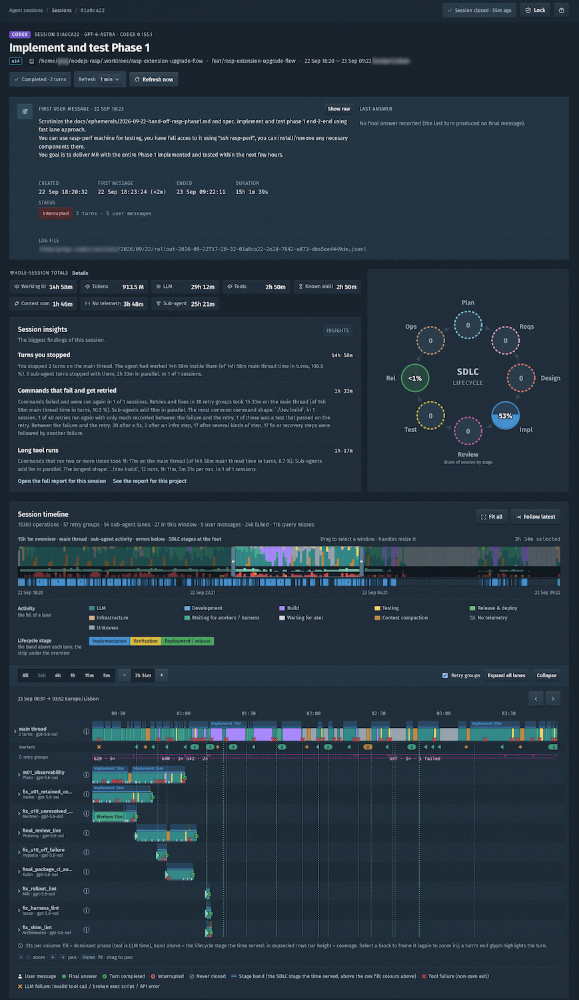
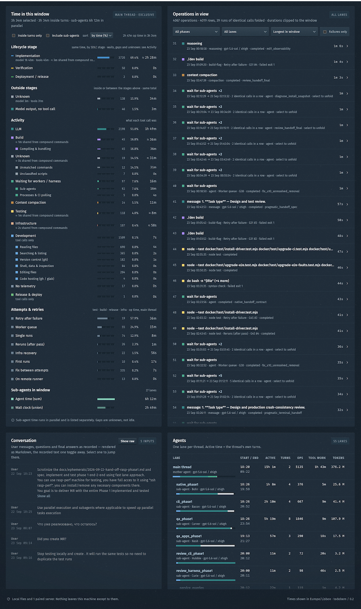

<div align="center">

# todobem

**A flight recorder for AI coding agents.**<br>
*Check what your agents did while you were sleeping.*

[](LICENSE)
[](go.mod)
[](go.mod)


[Quick start](#quick-start) · [What you get](#what-you-get) · [Why trust the numbers](#why-the-numbers-can-be-trusted) · [Fleet](#fleet-many-machines-one-dashboard) · [Architecture](docs/ARCHITECTURE.md)

</div>

Your agent ran for nine hours overnight. How much of that was the model thinking, how much was
builds and tests, how much was a retry loop, and how much was it waiting for you?

todobem is a local, single-binary wall-clock profiler for agent sessions. It reads the logs
**OpenAI Codex CLI** and **Claude Code** already write, replays every thread — the main agent and
each sub-agent — as a lane on one timeline, and accounts for every minute and every token: model
generation, builds, tests, retries, waits for workers, waits for *you* — and, labelled as such,
the time it cannot classify. Then it groups where the time went by the habits of your
**harness** (prompts, delegation, skills, rules, models, effort settings), with the evidence one
click away.

```sh
go install github.com/extractumio/todobem/cmd/todobem@latest && todobem
```

No account, no cloud, no telemetry. Your sessions never leave your machine.

<table>
  <tr>
    <td width="50%"></td>
    <td width="50%"></td>
  </tr>
  <tr>
    <td align="center"><sub><b>Session</b> — 15 h, 54 sub-agents, 57 retry groups on one timeline</sub></td>
    <td align="center"><sub><b>Breakdown</b> — where a 3.5-hour window went, by stage and by activity</sub></td>
  </tr>
</table>

## Why

An agent session runs for hours, spawns sub-agents, retries tests, waits for you, compacts its
context, and hands you a result and a bill. What it does not hand you is an explanation. Which
hour was the model thinking? Which was a test loop? Which was the agent waiting for a reply you
never saw? Which was three sub-agents running one after another instead of in parallel?

The harness is the part you control — and exactly the part nobody measures. todobem measures it,
from logs you already have.

## What you get

**🎞 Inspect — the flight recorder.** One lane per agent thread, phases coloured by what each
tool call was, markers for your messages, the agent's questions, final answers and compactions.
Zoom to a single operation and see its command, exit code, the rule that classified it and the
raw source event. Read the conversation as recorded. Follow a running session live.

**⏱ Profile — where the hours and the tokens went.** An exclusive partition of the wall clock
that adds up to the elapsed time: LLM, development, build, test, release, infrastructure, waiting
for workers, waiting for you, compaction, no telemetry. A second partition of the same minutes by
SDLC stage — plan, implement, review, test, release, operate. Retry groups and the fixes between
attempts, background processes, sub-agent time in parallel, per-thread token usage.

**💡 Improve — Insights.** A report over a period and a project, in groups you can act on:
*You and the agent*, *Sub-agents*, *Verification loop*, *Failures and retries*, *Tool calls*,
*Long tool runs*, *Context size*, *Models and effort*, *Not measured*. Every card is one
deterministic detector that states what happened, its denominator, what to do — and links to the
sessions, lanes and intervals it came from. It surfaces things like:

- how long the agent sat waiting for your answer, and what the break cost in cache to rebuild;
- sub-agents that ran serially while the main thread idled;
- commands that fail and get retried, failed edits, invalid tool calls;
- the longest tool runs by command shape, and processes left running after their turn;
- how large the context grows and what compaction pauses add up to;
- which model and effort level served which stage;
- what could *not* be measured — named, not hidden.

**The loop:** measure a period → change **one** thing in the harness → measure the next period.
Every finding links to its sessions, so the change is argued from evidence and the next report
shows whether it worked.

## Quick start

Requires Go 1.22+. Nothing else — no npm, no database, no build step for the UI.

```sh
go install github.com/extractumio/todobem/cmd/todobem@latest
todobem                 # serves http://127.0.0.1:7788 and opens it, logged in (macOS, Linux)
todobem token           # a one-time login link, for any other browser or platform
```

Or from a clone, running in the background:

```sh
git clone https://github.com/extractumio/todobem && cd todobem
./scripts/deploy.sh     # builds, starts on 127.0.0.1:7788, prints a login link
./scripts/deploy.sh status | stop | run   # run = foreground, for systemd
```

`deploy.sh` takes its options from the environment: `ADDR=`, `CODEX=` / `CLAUDE=`, `RULES=`,
`AUTH=off`, `AGENT=1` (agent mode, see [Fleet](#fleet-many-machines-one-dashboard)).

By default it reads `~/.codex` and `~/.claude`. Point it elsewhere from the **Settings** page
— several folders per source (a tree copied from a laptop, a collected tree on a server), saved
to `~/.todobem/settings.json` and applied live. Each entry is a *home*: the folder that contains
`sessions/` (Codex) or `projects/` (Claude Code); an empty list turns that source off. Or pin a
run on the command line, which makes the Settings page read-only:

```sh
todobem -codex /srv/rollouts/codex          # exactly this Codex home; Claude Code off
todobem -codex ~/.codex -claude ~/.claude   # both, pinned
todobem -addr 127.0.0.1:9000 -open=false
```

Other flags: `-settings <file>`, `-rules <file>` (see below), `-cache=off`, `-auth=off`.

On a remote host, keep the loopback bind and tunnel: `ssh -L 7788:127.0.0.1:7788 <host>`.
Browser cookies are not port-scoped, so give a tunnelled and a local todobem different ports.

## Why the numbers can be trusted

- **Nothing is inferred from a duration.** A long operation is listed, never explained.
- **Classification is a rule table over the literal command text** — deterministic and
  inspectable (`/api/rules`, the in-app guide). No similarity, no models.
- **Unknown is honest.** A command no rule matches is `unknown`; an interval without events is
  `no telemetry`. Neither is folded into something that looks better.
- **Every total is an exclusive partition** of the wall clock; the parts add up to the elapsed
  time. Sub-agent time is reported in parallel, never added. Raw sums are shown beside it.
- **No "goal achieved" score.** Your messages and the agent's answers are shown as recorded.
- **Every insight has evidence.** A card with no session, lane or interval to open is not shown.
  No savings estimates.

## Teach it your project

Your project has commands no built-in rule has seen — an in-house CI wrapper, a deploy script. A
**user overlay** (`~/.todobem/rules.json`) adds them, along with your review and planning skill
names, reviewer agent roles and design-document paths. The overlay is part of the cache key, so
every session re-parses under the new rules by itself.

```sh
todobem unknown -since 7d                      # unmatched commands across recent sessions, by time
todobem unknown -explain 'scripts/gen-sdk.sh'  # what the rules say about one command
todobem unknown -rules draft.json -since 7d    # dry-run a draft overlay before installing it
```

Or let an agent do it: the bundled **`resolve-unknown`** skill
(`.claude/skills/resolve-unknown/`, also under `.codex/skills/`) takes the unknown table top-down,
establishes what each command does from evidence — the script, its `--help`, what it spawns —
writes the narrowest rule that covers it, dry-runs it and reports what was reclaimed.

## Private by design

Sessions contain whatever your agents read and wrote, so todobem treats them that way:

- **Loopback by default.** The UI binds to `127.0.0.1:7788`; keep it there and tunnel.
- **Locked UI.** Every API route needs a session opened with a one-time token minted in a
  terminal on the same machine (`todobem token`). The key lives in `~/.todobem/auth.key` (0600);
  `todobem token -revoke` logs everyone out immediately.
- **Read-only.** The session logs are never written to; todobem writes only under `~/.todobem/`
  (settings, key, cache).
- **No outbound calls, no telemetry** — the one exception is a fleet you pair yourself (below).

<details>
<summary><b>Access commands</b></summary>

```sh
todobem token             # a login link (one use, valid 5 min) and the bare token
todobem token -ttl 12h    # the browser stays logged in for 12 h (default 30 days)
todobem token -revoke     # rotate the key: every session and token stops working now
todobem cache -prune      # drop cached sessions the configured folders no longer list
```

The session is an HttpOnly, SameSite=Strict cookie scoped to `/api`. `-auth=off` leaves the UI
open, and the server says so at start.
</details>

## Fleet: many machines, one dashboard

Agents running on build servers? Run the same binary headless on each of them and read them all
from your laptop. An **agent** (`todobem -agent`) parses its host's sessions and *answers* a
**hub** — any ordinary todobem — over TLS with a certificate pinned at pairing and a bearer on
every request. It never connects anywhere; the hub dials only the agents it paired with.

```sh
# on each server
todobem -agent                         # TLS on :7789, every interface, no UI; prints a pairing string
todobem agent pair                     # another pairing string later (one use, 5 min)

# on the hub
todobem hub add 'todobem-agent://…'    # pair (-name web-01 -addr 10.0.0.5:7789 before the string)
todobem hub list                       # every agent, its build and session count
todobem hub doctor -all                # health of every agent, in parallel
todobem hub rotate web-01              # a new bearer; the old one retires on first use of the new
todobem hub remove -revoke web-01      # forget it, and revoke its bearer
```

The agent listens on every interface; firewall `:7789` to the hub.

Remote sessions join the list with a host chip; Insights filter by host; a remote session opens
as if it were local. Design and wire protocol: [`docs/AGENT-MODE.md`](docs/AGENT-MODE.md).

<details>
<summary><b>systemd unit for an agent</b></summary>

```ini
[Unit]
Description=todobem agent
After=network-online.target

[Service]
User=ci
ExecStart=/usr/local/bin/todobem -agent
Restart=on-failure
RestartSec=5

[Install]
WantedBy=multi-user.target
```
</details>

## Supported sources

| Source | Reads | Verified |
|---|---|---|
| OpenAI Codex CLI | `~/.codex/sessions/`, `archived_sessions/` (`rollout-*.jsonl`) | 0.134 → 0.154 |
| Claude Code | `~/.claude/projects/<project>/*.jsonl` and each session's sub-agents | 2.1.226 → 2.1.270 |

Codex CLI 0.144+ stores inter-agent messages encrypted, so for those sessions a sub-agent's card
says so instead of showing the prompt it was spawned with.

The model is source-agnostic (`internal/model`); both sources share one session list, one
timeline and one Insights report. A new source is one package implementing `source.Source` — see
[`docs/ARCHITECTURE.md`](docs/ARCHITECTURE.md) §12.

## How it works

```
session logs ──▶ source adapters ──▶ classify ──▶ derive ──▶ cache ──▶ JSON API ──▶ web UI
 (jsonl, tailed)   (Codex, Claude)    (rule table)  (partitions,   (gzip,     (loopback,   (vanilla JS
                                                     stages,        on disk)   token-gated)  + SVG)
                                                     retry groups)
```

Logs are read incrementally by byte offset, so a live session is followed without re-parsing it.
Parsed sessions are cached to disk; a 354 MB session opens in ~0.16 s from cache instead of
~3.7 s cold, and a rule change or a grown file re-parses automatically. Go standard library only;
the UI is plain JavaScript and SVG embedded in the binary.

Everything — the schema, log formats, classification, the partitions, stage detection, Insights
and the validation protocol — is in [`docs/ARCHITECTURE.md`](docs/ARCHITECTURE.md).

## Development

```sh
make test                          # gofmt, go vet, go test, and the JS tests (node --test)
go run ./cmd/dump <session-id>     # totals, per-lane partition check, retry groups, unknown heads
./scripts/deploy.sh                # rebuild and replace the running instance on :7788
```

Contributor rules and the repository map: [`CLAUDE.md`](CLAUDE.md) (`AGENTS.md` links to it).

## License

todobem is dual-licensed — see [`LICENSING.md`](LICENSING.md):

- **AGPL-3.0** ([`LICENSE`](LICENSE)) — personal, research and non-commercial use, and any
  project that meets the AGPL's copyleft obligations.
- **Commercial license** — for use without those obligations (proprietary products, hosted
  services). Contact [info@extractum.io](mailto:info@extractum.io).

Contributions are accepted under the terms in `LICENSING.md`.
